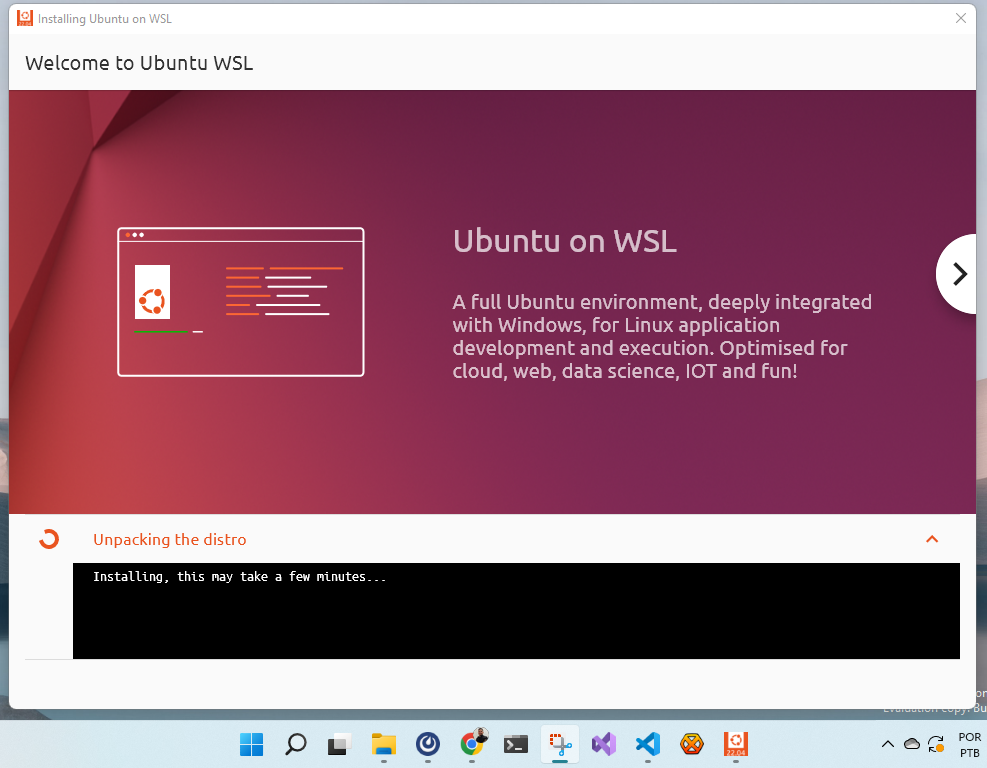

# Ubuntu WSL Splash

A graphical application to enhance user experience with Ubuntu on WSL during the distro installation process. Made with:

 [![Flutter](https://img.shields.io/badge/-Flutter-555?style=flat-square&logo=data:image/png;base64,iVBORw0KGgoAAAANSUhEUgAAABMAAAAYCAYAAAAYl8YPAAAACXBIWXMAAAAkAAAAJAGHsLAiAAAAGXRFWHRTb2Z0d2FyZQB3d3cuaW5rc2NhcGUub3Jnm+48GgAAAoNJREFUOI2NlU9IVFEUxr9z79NZmAUubFG0ChPLeQMFQS4i0laFC7N/REGZlRWEKZKVTC3SCFMjMhNy1FaOg9XSN2a0aiHRDJgjUhSBBpZaU1A4c08LR3059zlzdu98h9/53ne57xHSrPJRzpyNcYDA+zUyM3DBSBc0F2O/EwiES0G3bJepQNtHOEMQ+wEu1ekE1FmmbAWAVZ2V97Gcy1A9DGhBzLhqeeTdxWexKmiL6gVwxGHkWtAjm+wNLay8j+VsnuoGcFSLYTRYpry9sp2UmZdZTMSVjwjHdRwCbloeeUun/Q9jJiOkHhHhlNYR0GyZst5BA9lBJWH1EMA53SAzWoIeWe0EAhYzY6bisHrgBALQlgq04IyZSkLqPggXHax3DrrFWRBxKphRElYtTiAQOgYLxXkQccJ9PcB79CjZbjDwiXQao6vILaqshKPisKoBcMIe89JOwhPLTQERNGUrGFdW6N1FpqjwEikAKA7FawFU6HfCZ7nlHSBxAJZH3mOgNrHHPz+zDCrwvbf+Rn/fACvNC6ieIVM2Lqdiq32h2MF143LAf4jiAFDYE3mWvTG3FABkphF1ZWdN2Sz1BU3RYD8YbVwAsK030r92Q26ZvSddxk/XmqyvBBWwBozr8C64XxWW7xurzNm0vkOn/Zicfjf6PG8H/Avu7aW96JGT+Z2/pr4Pr+xPj3/G2MBrj1CdHQAnGdF/gog4fGzz3ujkt1eLrZkPX/Dx5QgABoDToiwZ6JgZAICZCp9Ghuf/xHZPDL4Bq6RL0KYClZfTgyWAxuGuRhWP1TlMtKhAZXV6sESJssdNAPRAombVf6Ym5Q9lyeDYiyHa+jYHwE6NvIsKDoh/P0T0VGjgES8AAAAASUVORK5CYII=)](https://flutter.dev/)
 
 [![C++](https://img.shields.io/badge/-C++-555?style=flat-square&logo=data:image/png;base64,iVBORw0KGgoAAAANSUhEUgAAABUAAAAYCAYAAAAVibZIAAAABmJLR0QA/wD/AP+gvaeTAAAACXBIWXMAAAEHAAABBwEflNFYAAAAB3RJTUUH5QEVEDotrKqP8AAAA9VJREFUOMuVlVtMXFUUhr99ZhjKcBvulwnhUkODFSQp0VYsmrRpjD7UF9GakEYDalptE1ORGiVEoiaYNGopidA0PjT6UHsx0VYNYoVAtYrCYIvU0sGhIDAwwDA3Zs7M9oF0Ogc70O63s9ba31577f+sJVhn1XYMlQgZagFRBbJbCqX+eF3p8Fp7RDTHvmNXElS9ekgKcRgwRLhUKWSbEgo0tr9csXh3UClF7XFLjZCiBciKdqgUzAkpmxdMI62nqquDUaG1HZYtwFEh2cbdr99BvNbxUmmfBrq/dThtOdbfKKR4FVBW79IpgjiDDrdPRUZJHOTJmIC+vm3/5ilR22F5Uki+AJIioxRFUFmcwqObUijINCIANSj5Z9ZL97CDX0YXCIX+d4QTeE7UtQ+OgciP9CQb9ezblU9hhjHqnUf+ddPxgw2nVw3bPIFA//eD17yirt2iOS42RqFh90bMKRvWLeaEw8cHX42yHAhO/jY2YR0Ym6wE0K8OfLoiSwNUQ5I/rItMzi+TmWSgoiiZGP1K2dMTDWQkYWk+218cDIVyb+3RQOMMOh4rSQt/u3wqR85buTnnC9u+tdg59FQR16fdjpq2Lv+Vm46y1YlpoCW58eh1t1V2+vKUBghgm/Nc2950wT84PvOAIgSFGYlY7UsY9ArZJiO2WZcWmp5k0ACGxpciNbNwdWLKculvW6WU6ACer9zI4d0PUtN2kcdLcqjeWsSLn3ZrofLOv1vIsei8dL671+wVeohPlus9oAY66/RrnOX5ieOvHz3nnXHMV65YlgvweG+kmrOcDr8o/7x3lN6Raaz2Jf4cn+fLy2PYZl3av2d40kUgeDuRJ8rS8nJMhuLImM0FaUXDH+0p//pglSMvJXbKal8pkV8NYZt1rdxwlU79zz6cbt9RlmMOG9QgZ3r+4qrNzn25qTxTdT9xsSsXdPv87D1ywXJ6yF6MEGEdhqFuj/fXb37qzQ6q/ry+j1+gtDBzXfEP3phm24ETeJfVSeKTrBgTKgHE3mP9Pb39FsN12/hDt4KzUxM421TN1hJzVGDXwBh73jvDzII74mWVAUypbt2gzzzlcDpfAWLDovf6+ey7AWx2JxnJRszpiQgh8PlVfh6e4K0TP/JmRycur391szLicR9cUc2O99NQ1EYkd2x9ep2CKWEDc04PUkZrfeIkarCei01T2s6/690tSPkJUjxyD026n5BygK63+9aYUVKws7kGWHOcAHMI0YxpUyun1hgn2qw/jCfkeQNEQ2S9ARVBG9LQSGfD4j1N0/Da2VwCsgXYDvSAqKfznTVH9H+akJBFbCvsXgAAAABJRU5ErkJggg==)](https://isocpp.org/)





## Getting Started

To experiment with the code you'll need Flutter on Windows. Refer to [the Flutter documentation](https://docs.flutter.dev/get-started/install/windows) if you need to install it on Windows. You can skip the steps related to Android.

Also, Flutter requires Visual Studio. You can download the community edition from [the IDE offical website](https://visualstudio.microsoft.com/). Make sure to read Flutter documentation thoroughly.

> Beware: We are not talking about VSCode!

With Flutter and Visual Studio installed, you can `git clone` this repository (or download the source code from it) and:

```powershell
cd ubuntu_wsl_splash
flutter run
```

You can also use your favorite editor/IDE to work with this project, like VSCode, IntelliJ or even Vim.

## Contributing

Before submitting any issues or pull requests, make sure to review  our [contributor guidelines](CONTRIBUTING.md).

## Technical details

Please check the [explanation](./doc/details.md) if you want to know more about how this project works.

## License

The Ubuntu Desktop Installer is licensed under the [GNU General Public License version 3](LICENSE).